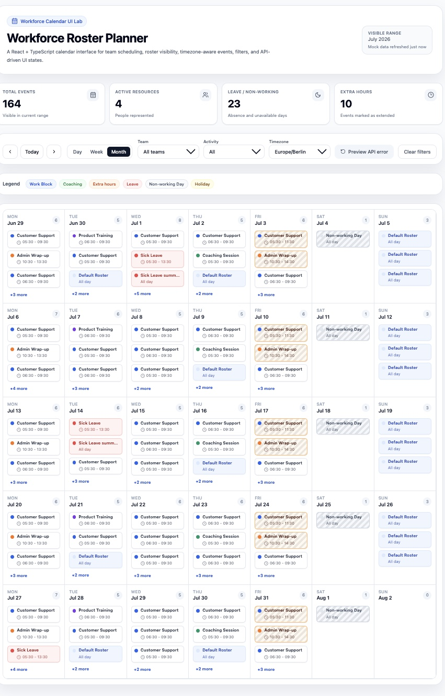
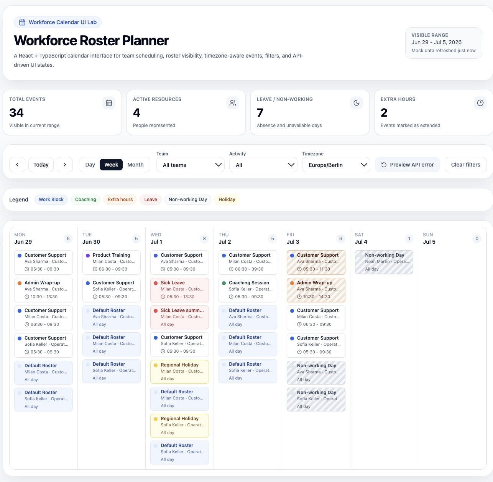
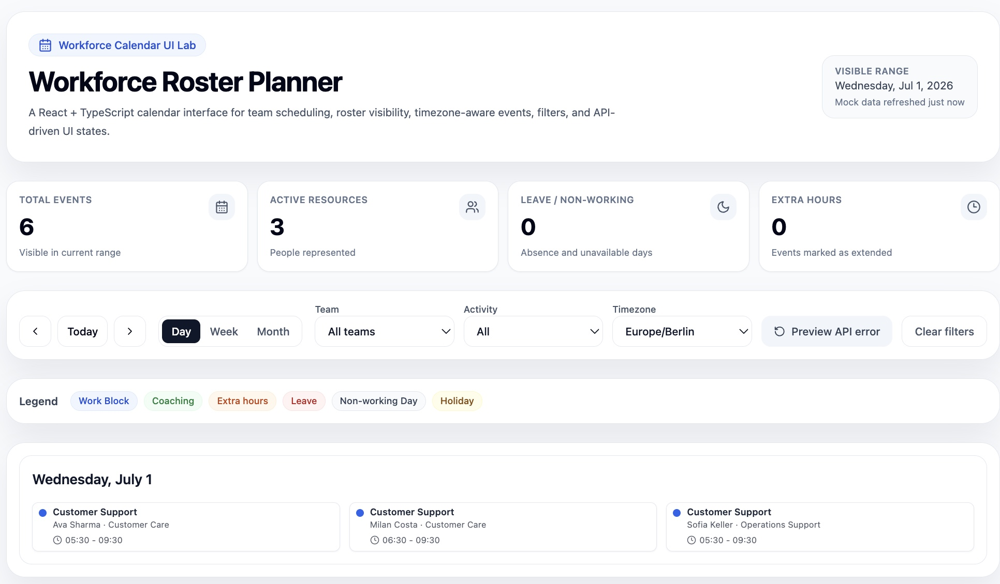
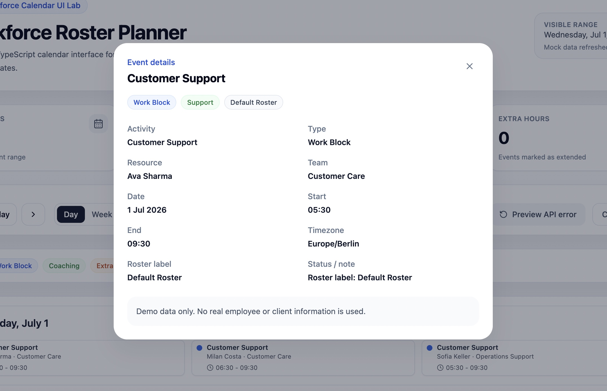
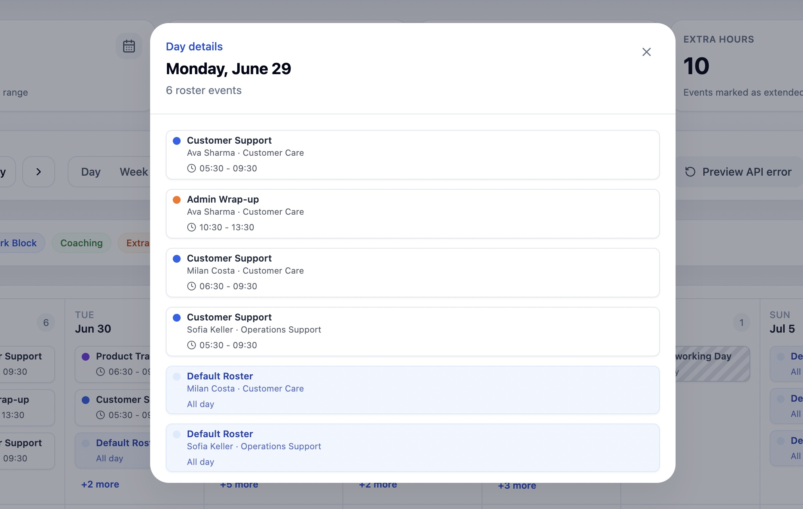
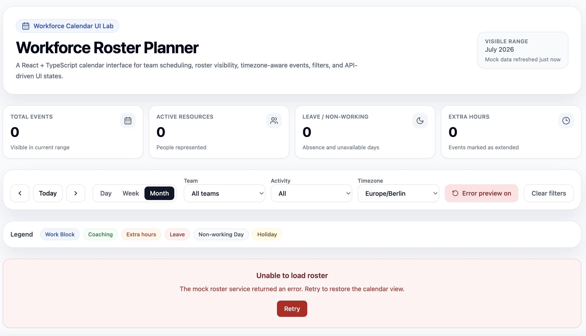

# Workforce Calendar UI Lab

A polished React + TypeScript calendar dashboard for exploring fake workforce roster data, schedule visibility, timezone-aware event rendering, filters, and API-driven UI states.

## Live Demo

- Live Demo: https://workforce-calendar-ui-lab.vercel.app
- GitHub Repo: https://github.com/N-Mangla/workforce-calendar-ui-lab

## Why I Built This

Scheduling interfaces are deceptively complex: they combine dense calendar layouts, async data loading, filters, event categorization, accessible details panels, and edge states such as empty results or service errors. This project packages those product UI patterns into a public portfolio demo with safe, generic mock data.

## What This Demonstrates

- Building complex React + TypeScript product interfaces
- Separating API models from UI rendering models
- Handling async loading, retry, and error states
- Designing dense calendar UI with readable event density
- Creating reusable components and testable transformation logic
- Managing calendar filters, view modes, and timezone-aware event display

## Features

- Day, week, and month roster calendar views
- Compact dashboard metrics for visible events, active resources, leave/non-working time, and extra hours
- Month view density management with a maximum of three events per day and a clickable `+X more` details panel
- Event details modal with activity, resource, team, date, time, timezone, type, and notes
- Team, activity, timezone, and view-mode controls
- Fake API service with realistic loading, retry, and error states
- Timezone-aware event labels
- Reusable UI primitives for badges, empty states, error states, loading overlays, and event cards
- Unit-tested roster API-to-calendar transformation logic

## Tech Stack

- React 18
- TypeScript
- Vite
- Tailwind CSS
- TanStack Query
- Zustand
- date-fns
- Vitest
- React Testing Library

## Architecture Notes

```txt
Mock roster service
   ↓
transformRosterEvents()
   ↓
CalendarEvent UI model
   ↓
Filter + range state
   ↓
Calendar dashboard components
```

The transformation layer keeps mock API shapes separate from UI rendering models. Calendar state is split between URL-independent product state in Zustand and async data state in TanStack Query, which keeps loading, retry, cached ranges, and UI filters easier to reason about.

## Screenshots

| Month View | Week View | Day View |
|---|---|---|
|  |  |  |

| Day Details Modal | Event Details Modal |
|---|---|
|  |  |

| Error State |
|---|
|  |

## Local Run Instructions

```bash
npm install
npm run dev
```

## Testing Instructions

```bash
npm run test
npm run build
```

## Confidentiality Note

This is an independent demo project using fake roster data. It does not contain proprietary code, real client data, internal API contracts, or confidential implementation details.